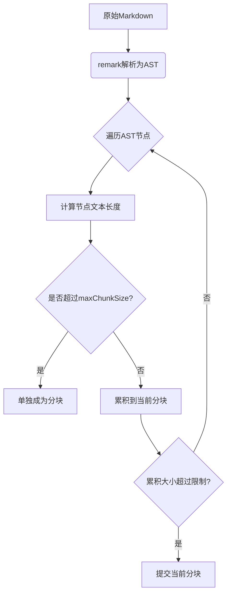

# md-segmenter

[](https://www.npmjs.org/package/md-segmenter)
[](https://astexplorer.net/)

**Markdown Structural Segmentation using remark AST**

Split large Markdown documents into chunks while preserving syntax integrity, maintaining complete blocks (code, tables, etc) within chunks.

## 核心特性

- **AST准确分割** - 基于remark语法树的分块策略
- **块级保护** - 从不分割代码块/表格等完整语法结构
- **安全验证** - 参数类型及范围的严格校验

## 安装

```bash
npm install md-segmenter
```

## 使用方法

### 基础分块

```javascript
import { splitMD } from 'md-segmenter';

const mdContent = `
# 文档标题

\`\`\`js
// 完整的代码块会被保留
console.log('Hello World');
\`\`\`

- 列表项
  - 嵌套列表项
`;

const chunks = splitMD(mdContent, {
  maxChunkSize: 3000, // 默认3000字符
});

console.log(chunks.length); // 输出分块数量
```

### 异常处理

```javascript
try {
  splitMD(123); // 传入非字符串参数
} catch (err) {
  console.error(err.message); // 'Input content must be a valid string'
}
```

## API 文档

### `splitMD(mdContent, options)`

#### 参数

| 参数名    | 类型   | 必填 | 默认值 | 描述                       |
| --------- | ------ | ---- | ------ | -------------------------- |
| mdContent | string | 是   | -      | 需要分割的Markdown原始内容 |
| options   | object | 否   | {}     | 配置选项                   |

#### 配置项

| 属性         | 类型   | 默认值 | 描述                     |
| ------------ | ------ | ------ | ------------------------ |
| maxChunkSize | number | 3000   | 单个分块允许的最大字符数 |

#### 返回值

string[] - 分割后的Markdown字符串数组，每个元素为一个完整分块

## 实现原理



## 限制说明

1. **不可拆分节点** - 如果单个语法节点（如代码块）超过maxChunkSize，会单独成块
2. **无文本截断** - 严格基于AST节点分割，不进行文本级截断
3. **空白处理** - 保留原始文档中的空行和格式
